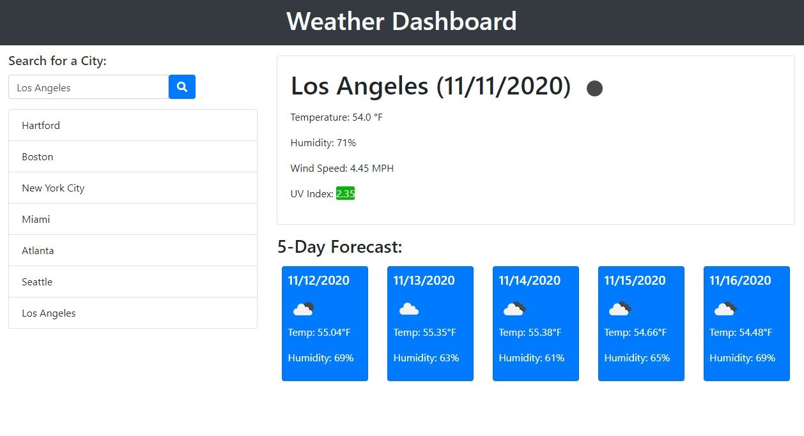

# Weather Dashboard

## Description

This application allows a user to find out the current weather for the city they enter in a search bar.

The information they will see includes:

* City name and current date (Month/Day/Year):

* An icon indicated current conditions (i.e., sunny, cloudy, rain, snow, etc.)

* Temperature: (measured in Fahrenheit, with 1 decimal point).

* Humidity: (0-100%).

* Wind Speed: (in MPH).

* UV Index: (with styling that indicates whether the value is favorable (green), moderate (golden-yellow) or severe (red)).

As well, they will see a 5-Day Forecast below the current weather section. This forecast is for the next 5 days, not including the current day.

Each individual card shows:

* The respective date (Month/Day/Year)

* An icon indicated projected conditions (sunny, cloudy, rain, snow, etc.)

* Temperature: (measured in Fahrenheit, with 2 decimal points).

* Humidity: (0-100%).

## Usage

To start, a user just needs to enter the location they wish to see weather info for in the search bar, then click the search button.

They will then see the current weather and date, including the temperature, humidity, wind speed and UV index, and an icon indicating current conditions (sunny, cloudy, rain, snow, etc).

As well, they will see the 5-Day forecast, each day showing the temperature, humidity level and an icon indicating projected conditions (sunny, cloudy, rain, snow, etc).

## Finished Application

Check the current weather and 5-Day forecast now:

[Weather Dashboard](https://mikeh138.github.io/weather-dashboard/)

## Code of Conduct

  

## License

&copy; 2020 Mike Henson  

Licensed under the [MIT](LICENSE.txt) license.